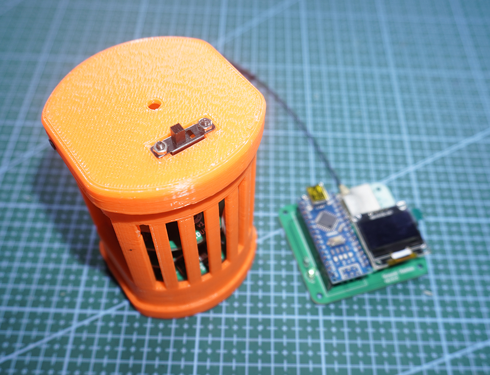

# EDUCAN_Software_Public
EDUCAN [EDUCATIONAL CANSAT] is an educational kit designed for high school students where students can get started in satellite building. Students can learn soldering, electronics design, programming and CAD Design using our tool. The kit can easily be programmed via arduino IDE which makes learning a lot easier for beginners.

